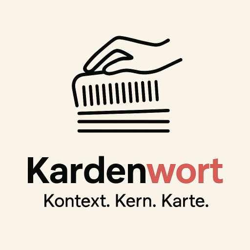
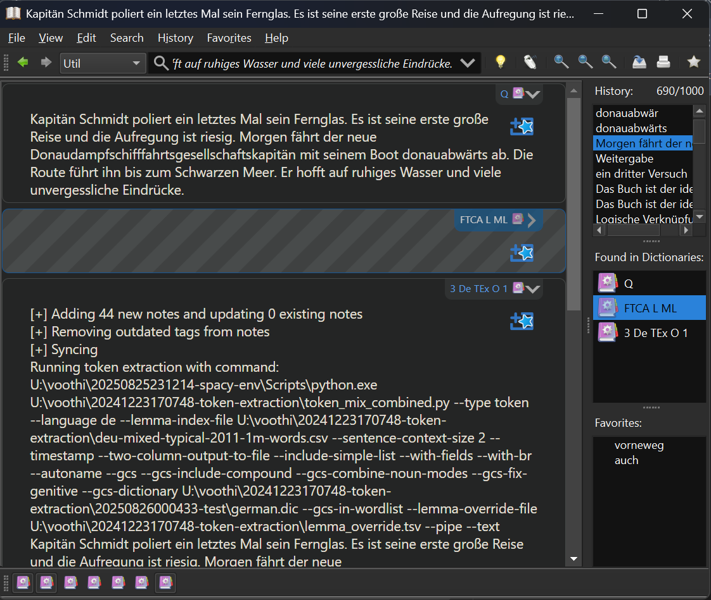
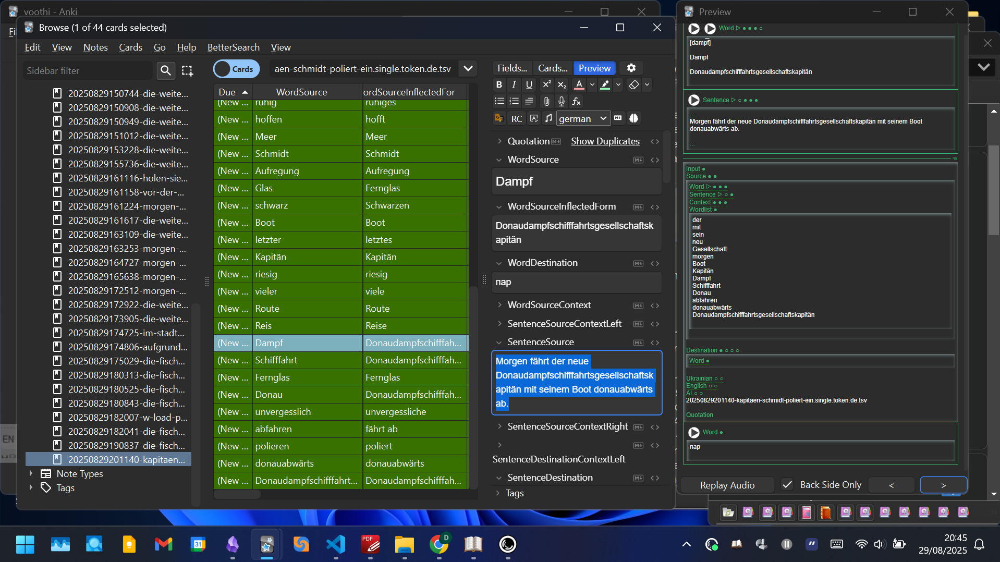

<p align="center">
  
</p>

# Kardenwort

> *Kontext. Kern. Karte.* (Context. Core. Card.)

[](https://github.com/kardenwort/20250913122858-kardenwort)

**Kardenwort** is an intelligent command-line utility designed to accelerate language learning by deconstructing text and automatically creating context-rich flashcards for **Anki**. It serves as a powerful offline companion to your study materials, transforming any text—books, articles, or AI-generated content—into a structured vocabulary list ready for efficient learning.

This tool is not just a word collector; it's an intelligent pipeline powered by two NLP libraries, large dictionaries, semantic rules, and a user-trainable override system to achieve high-accuracy lemmatization and word deconstruction, especially for grammatically complex languages like German.

## Map of Contents
- [Kardenwort](#kardenwort)
  - [Map of Contents](#map-of-contents)
  - [The Kardenwort Philosophy in Brief](#the-kardenwort-philosophy-in-brief)
  - [The Kardenwort Ecosystem](#the-kardenwort-ecosystem)
  - [Key Features](#key-features)
  - [Key Advantages and Differences from Alternatives](#key-advantages-and-differences-from-alternatives)
  - [Project Structure](#project-structure)
  - [Installation and Setup](#installation-and-setup)
  - [Usage and Workflows](#usage-and-workflows)
    - [Command-Line Runner](#command-line-runner)
    - [Using Pre-configured Windows CMD Scripts](#using-pre-configured-windows-cmd-scripts)
      - [⚠️ Important Limitation: Single-Line Processing](#️-important-limitation-single-line-processing)
    - [GoldenDict-ng Integration](#goldendict-ng-integration)
  - [Core Functionality: The Two Main Modes](#core-functionality-the-two-main-modes)
  - [Understanding Input Processing](#understanding-input-processing)
    - [The Hybrid Mechanism for Sentence Splitting](#the-hybrid-mechanism-for-sentence-splitting)
  - [The Processing Pipeline in Detail](#the-processing-pipeline-in-detail)
  - [The Anki Card Template](#the-anki-card-template)
  - [Command-Line Arguments Reference](#command-line-arguments-reference)
    - [Core Arguments](#core-arguments)
    - [Input \& Output](#input--output)
    - [NLP \& Lemmatization Control](#nlp--lemmatization-control)
    - [Card Content \& Formatting](#card-content--formatting)
    - [German Compound Splitting (GCS) Options](#german-compound-splitting-gcs-options)
    - [Standard Output (STDOUT) Options](#standard-output-stdout-options)
  - [Configuration](#configuration)
  - [Important Notes](#important-notes)
  - [Development and Testing](#development-and-testing)
  - [My Personal Motivation](#my-personal-motivation)
  - [License and Acknowledgements](#license-and-acknowledgements)

---

## The Kardenwort Philosophy in Brief

The goal of Kardenwort is to reduce the complexity of language learning, particularly for synthetic languages like German where words are heavily inflected and compounded. It achieves this by automating the difficult task of deconstructing words to their base form (lemma).

Our core principles are:
*   **Separating Reading from Study:** Reduce cognitive load by splitting content consumption and vocabulary acquisition into two distinct, focused activities.
*   **Medium Independence:** Kardenwort is a companion to your learning material, not a replacement. Use it with physical books, PDFs, or any other media without losing the original context (diagrams, formatting, etc.).
*   **Offline First & Privacy:** The entire process runs locally. Your data is never sent to the cloud, ensuring privacy and reliability.
*   **Simple is Not Easy:** We do the complex work of linguistic analysis to provide you with a simple, clean, and actionable list of words, making your learning process easy.

[Return to Top](#map-of-contents)

---

## The Kardenwort Ecosystem
The power of Kardenwort is fully unlocked through its integration with other purpose-built tools, creating a seamless pipeline from text to flashcard.

1.  **`20250913122858-kardenwort` (This Project):** The core engine. It performs the heavy lifting of text processing (NLP) and generates a structured TSV file.
2.  **`20250913123240-kardenwort-anki-csv-importer`**: The bridge. A script that programmatically imports the generated TSV file into Anki using the AnkiConnect add-on.
3.  **`20250913123501-kardenwort-anki-templates`**: The canvas. A feature-rich Anki note type with interactive fields designed to perfectly display the data generated by Kardenwort.

Running a single command triggers the entire chain, making deck creation effortless.

[Return to Top](#map-of-contents)

---

## Key Features
*   **Intelligent Lemmatization:** Uses `spaCy` to accurately find the base form of words.
*   **Advanced German Deconstruction:** Employs `german-compound-splitter` (GCS) to break down long German compound words into their components.
*   **User-Trainable:** Fine-tune the lemmatization for your specific texts using a simple `lemma_override.tsv` file. Corrections are saved forever and automatically reapplied.
*   **Rich Context:** Each word card includes the original sentence and surrounding context.
*   **Dual Card Types:** Generates both vocabulary cards (`word` type) and full sentence cards (`sentence` type).
*   **Multi-Language Support:** Currently supports **English (en)** and **German (de)**.
*   **Direct Anki Integration:** Automatically imports generated cards into Anki via a runner script.
*   **GoldenDict-ng Integration:** Create vocabulary lists on-the-fly directly from your favorite dictionary application.
*   **Auditory-Focused Cards:** The template is designed to work with audio, helping you practice listening and pronunciation.

[Return to Top](#map-of-contents)

---

## Key Advantages and Differences from Alternatives

While many text-processing tools for language learners exist (e.g., LWT, Lute, LingQ, VocabSieve, Readlang), Kardenwort offers a unique combination of capabilities:

*   **Superior German Language Processing:** No other tool provides this level of German vocabulary deconstruction. Kardenwort correctly parses compound nouns, finds verbs with separable prefixes, and handles capitalization properly—a common pain point in other systems.
*   **Complete Freedom After Export:** Unlike integrated readers where a flashcard is tied to the source text, our output is a fully autonomous TSV file. You have complete control to edit any field in Anki on any device, truly freeing your data.
*   **Quality You Can Influence:** While the initial analysis relies on `spaCy`, you can directly influence the results. By training the system through the `lemma_override.tsv` file, you can achieve perfect processing for your specific texts and domain.

[Return to Top](#map-of-contents)

---

## Project Structure
```
20250913122858-kardenwort/
├── data/
│   ├── de/
│   │   ├── deu-mixed-typical-2011-1m-words.csv
│   │   ├── german.dic
│   │   └── lemma_override_de.tsv
│   └── en/
│       ├── en-news-2023-1m-words.csv
│       └── lemma_override_en.tsv
├── docs/
│   ├── assets/
│   │   ├── 20250829201257.png
│   │   └── ...
│   └── kardenwort-goldendict-config.txt
├── results/
│   └── 20250913171939-morgen-faehrt-der-neue.triple.word.de.tsv
├── source_texts/
│   ├── text1.txt
│   ├── text2.txt
│   └── text3.txt
├── src/
│   └── kardenwort/
│       └── core/
│           ├── kardenwort.py
│           └── kardenwort_runner.py
├── tests/
│   ├── cases/
│   └── source_texts/
│       ├── de/
│       └── en/
├── .gitignore
├── config.ini
├── config.ini.template
├── LICENSE
└── README.md
```

[Return to Top](#map-of-contents)

---

## Installation and Setup

Follow these steps to get the entire Kardenwort ecosystem up and running.

**Prerequisites:**
*   **Python 3.9**: It is **strongly recommended** to use this specific version.
    > **Important for Windows Users:** Versions of Python higher than 3.9 (e.g., 3.10+) may require a C++ compiler (like Visual Studio Build Tools) to install dependencies such as `spaCy`. To avoid these compilation issues, we recommend installing **Python 3.9** directly from the **Microsoft Store**, which provides a hassle-free setup.
*   **Anki Desktop**: Must be installed and running.
*   **AnkiConnect Add-on**: Install the [AnkiConnect](https://ankiweb.net/shared/info/2055492159) add-on in Anki.

**Setup Steps:**

1.  **Clone the Repositories**:
    Clone all three projects into a common parent directory. For example, create a folder named `kardenwort-ecosystem` and clone the repositories inside it.
    ```bash
    mkdir kardenwort-ecosystem
    cd kardenwort-ecosystem
    git clone https://github.com/kardenwort/20250913122858-kardenwort.git
    git clone https://github.com/kardenwort/20250913123240-kardenwort-anki-csv-importer.git
    git clone https://github.com/kardenwort/20250913123501-kardenwort-anki-templates.git
    ```
    Your final structure will be:
    ```
    kardenwort-ecosystem/
    ├── 20250913122858-kardenwort/
    ├── 20250913123240-kardenwort-anki-csv-importer/
    └── 20250913123501-kardenwort-anki-templates/
    ```

2.  **Import the Anki Template**:
    In the `20250913123501-kardenwort-anki-templates` project, navigate to the `decks-for-first-initialize-templates` directory. Choose the latest version folder (e.g., `v1.0.0`), select **one** of the `.apkg` deck files inside, and import it into Anki Desktop. This will automatically add and configure the required note type.

3.  **Set up a Shared Python Environment**:
    We will create a single virtual environment one level above the project folders. This keeps the project directories clean and allows all scripts to use the same set of installed packages.
    ```bash
    # First, navigate into the main project directory
    cd 20250913122858-kardenwort

    # Create the virtual environment in the parent directory (../)
    python -m venv ../20250914043440-kardenwort-spacy-env

    # Activate it
    ../20250914043440-kardenwort-spacy-env/Scripts/Activate.ps1  # Windows (PowerShell)
    # source ../20250914043440-kardenwort-spacy-env/bin/activate # macOS/Linux

    # Now that the environment is active, install dependencies from the requirements file
    pip install -r requirements.txt

    # Download SpaCy language models
    python -m spacy download en_core_web_lg
    python -m spacy download de_core_news_lg
    ```

4.  **Configure Kardenwort**:
    *   While still inside the `20250913122858-kardenwort` directory, copy `config.ini.template` to `config.ini`.
    *   Open `config.ini` and verify the paths under `[environment]`. The default relative paths are designed for this structure and should work without changes.

5.  **Run a Test:**
    *   Add some German text to `source_texts/text1.txt`.
    *   Ensure Anki is running.
    *   From the root of the `20250913122858-kardenwort` project, execute the runner script. **Important:** Your virtual environment (`kardenwort-env`) must be active.
    ```bash
    # This creates vocabulary (word) cards from a single German text file
    python src/kardenwort/core/kardenwort_runner.py --type word --mode single --language de
    ```
    If successful, a new deck will appear in Anki. Your setup is complete

---

## Usage and Workflows

### Command-Line Runner
The primary way to use the utility is via the `kardenwort_runner.py` script, which automates the entire process of text analysis and Anki import.

For a comprehensive and up-to-date list of command-line examples for various scenarios, please refer to the configuration file:
`docs/kardenwort-goldendict-config.txt`

**Examples:**
```bash
# Create German vocabulary cards from text1.txt and text2.txt with compound splitting
python src/kardenwort/core/kardenwort_runner.py --type word --mode dual --language de --de-gcs

# Create English sentence cards from text1.txt and text2.txt
python src/kardenwort/core/kardenwort_runner.py --type sentence --mode dual --language en

# Process a single string of text directly from the command line
python src/kardenwort/core/kardenwort_runner.py --type word --mode single --language de --text "Das ist ein Test."
```

### Using Pre-configured Windows CMD Scripts
For Windows users, we provide a collection of ready-to-use batch scripts (`.cmd`) that cover all common processing scenarios. You can find them in the `scripts/run/cmd/` directory (e.g., `kardenwort_run_de_w_t_l_anki.cmd`).

These scripts offer a convenient way to run the tool without typing out all the arguments. However, they come with a significant limitation.

#### ⚠️ Important Limitation: Single-Line Processing
>
> Please be aware that these `.cmd` scripts have a limitation when used for on-the-fly text processing: they can only handle a **single line of input**.
>
> This restriction applies when text is passed directly via the `--text` argument or from standard input (stdin), which is a common method for integration with tools like GoldenDict.
>
> To process **multi-line text** in GoldenDict, you must bypass these convenient `.cmd` scripts. The correct approach is to configure GoldenDict to call the `kardenwort.py` or `kardenwort_runner.py` script directly. You can find the correct commands for this in the provided configuration file: **`docs/kardenwort-goldendict-config.txt`**.

### GoldenDict-ng Integration
Create vocabulary lists or Anki cards instantly from any word or phrase you look up in GoldenDict. This is a powerful workflow for on-the-fly analysis.

You can configure multiple "program" dictionaries in GoldenDict to run Kardenwort with different settings. For example, for German, you could have three modes:
*   **Simple (S):** Fast analysis without compound splitting.
*   **Medium (M):** Analysis with compound splitting for common word types.
*   **Large (L):** Deepest analysis, splitting compounds for almost all word types.

For detailed instructions and ready-to-use command-line examples, see the configuration file:
**`docs/kardenwort-goldendict-config.txt`**

<p align="center">
  
</p>

[Return to Top](#map-of-contents)

---

## Core Functionality: The Two Main Modes

The utility's primary goal is to extract material from text to create two types of cards, determined by the `--type` parameter:

1.  **`--type word` (Vocabulary Cards):**
    *   **Goal:** To create cards for studying individual words.
    *   **Mechanism:** The script analyzes the entire input text, extracts all unique words, reduces them to their base form (lemma), and creates a separate row for each unique lemma. Each row contains the lemma, its original inflected form, the sentence in which it first appeared, and surrounding context.
    *   **Specialty:** This mode includes advanced logic like German compound splitting (GCS) and handling of separable verbs, making it exceptionally powerful for German.

2.  **`--type sentence` (Sentence Cards):**
    *   **Goal:** To create cards with full sentences for studying phrases and grammar in context.
    *   **Mechanism:** The script processes input files line-by-line. For each line from the first file (`text1.txt`), one record is created. If parallel texts are provided (`text2.txt`, `text3.txt`), the corresponding lines are added to the same record.

The result of the script's execution is a **TSV (Tab-Separated Values) file**, which is ready for direct import into Anki or can be opened in any spreadsheet application (e.g., MS Excel, LibreOffice Calc) for analysis.

[Return to Top](#map-of-contents)

---

## Understanding Input Processing

How the utility receives and interprets input data is key to its effective use.

*   **Ways to Provide Data:** You can provide text via a command-line string (`--text "..."`), a file path (`--text1-file ...`), an environment variable, or piped through standard input.
*   **File Format:** Input files must be plain text (`.txt`) with **UTF-8** encoding. For parallel texts, line-by-line correspondence is crucial.

### The Hybrid Mechanism for Sentence Splitting
This is a critical feature. The utility automatically chooses how to split text into "processing units":
1.  **Line-by-Line Mode:** If the input text contains at least one newline character (`\n`), each line is treated as a separate, complete unit. This is ideal for subtitles or pre-formatted parallel texts.
2.  **Sentence Tokenization Mode:** If the input text is a single block without newlines, `spaCy`'s sentence tokenizer is used to grammatically split it into sentences. This is perfect for prose from articles or books.

This mechanism directly determines what you will see as `SentenceSource` and context on your Anki card.

[Return to Top](#map-of-contents)

---

## The Processing Pipeline in Detail
1.  **Initialization:** The script loads the `spaCy` model, GCS dictionary, user-defined `lemma_override.tsv`, and a word frequency index.
2.  **Text Ingestion:** Input text is read from a file, argument, environment variable, or stdin.
3.  **Tokenization & Lemmatization:** The text is broken into words (tokens). Each token undergoes a series of steps: GCS, separable verb handling, lemma correction, and application of user override rules.
4.  **Collection & Sorting:** Unique lemmas are collected and sorted. Known words (from the frequency index) are listed first (most to least common), followed by unknown words (alphabetically).
5.  **TSV Generation:** A structured TSV file is created with over 80 columns that match the Anki template.
6.  **Anki Import:** The runner script passes the TSV file to the `kardenwort-anki-csv-importer`, which creates a new deck in Anki.

[Return to Top](#map-of-contents)

---

## The Anki Card Template

The generated TSV files are designed for our feature-rich Anki template, which organizes the information into a clean and interactive layout.

<p align="center">
  
</p>

**Template Features:**
*   **Interactive Collapsible Sections**: Keep cards uncluttered by hiding and revealing information groups.
*   **Dynamic Fields**: Fields only appear if they contain data.
*   **Integrated Audio**: Supports both pre-recorded audio and text-to-speech.
*   **Context Display**: Shows the word in its original sentence, plus the preceding and succeeding sentences.
*   **Full Word List**: Displays all unique words (lemmas) found in the source sentence.

[Return to Top](#map-of-contents)

---

## Command-Line Arguments Reference

Below is a detailed list of all available arguments for the core processing script (`kardenwort.py`).

### Core Arguments
| Argument | Description | Example |
| :--- | :--- | :--- |
| `--type` | **(Required)** The type of cards to create (`word` or `sentence`). | `--type word` |
| `--language` | **(Required)** The source language of the text (`de` or `en`). | `--language de` |
| `--mode` | **(Required)** Processing mode for input files (`single`, `dual`, `triple`). | `--mode single` |

### Input & Output
| Argument | Description | Example |
| :--- | :--- | :--- |
| `--text` | Process a string directly. **Mutually exclusive with `--text1-file`**. | `--text "This is a test."` |
| `--text1-file` | Path to the primary source text file. | `--text1-file "source.txt"` |
| `--text2-file` | Path to the second text file (e.g., translation). | `--text2-file "target.txt"` |
| `--text3-file` | Path to the third text file. | `--text3-file "extra.txt"` |
| `--output-file` | Path for the output `.tsv` file. If omitted, prints to standard output. | `--output-file "out/my_deck.tsv"` |
| `--basename-add-timestamp` | Prepend a `YYYYMMDDHHMMSS-` timestamp to the output filename. | `--basename-add-timestamp` |
| `--basename-add-first-words` | Appends a slug to the filename, generated from the first `N` words of the text. `N` is an optional integer (default: 4). | `--basename-add-first-words 3` |
| `--stdout-print-output-basename` | Print the final output filename to standard output. Useful for chaining scripts. | `--stdout-print-output-basename` |

### NLP & Lemmatization Control
| Argument | Description | Example |
| :--- | :--- | :--- |
| `--lemma-override-file` | Path to a TSV file for context-aware lemma overrides. | `--lemma-override-file "data/overrides.tsv"` |
| `--lemma-index-file` | Path to a word frequency CSV file for sorting. | `--lemma-index-file "data/frequency.csv"` |

### Card Content & Formatting
| Argument | Description | Example |
| :--- | :--- | :--- |
| `--sentence-context-size` | Sets the number of preceding and succeeding sentences (`N`) to include as context. | `--sentence-context-size 2` |
| `--add-wordlist-col` | Include a simple list of all unique words from the source sentence in the `SentenceSourceWordlist` field. | `--add-wordlist-col` |
| `--wordlist-use-br` | Use `<br>` tags instead of newlines for the wordlist. | `--wordlist-use-br` |
| `--add-header` | Include the header row with all field names in the output TSV file. | `--add-header` |
| `--add-source-word-col` | Add the inflected (original) form of a word to the `WordSourceInflectedForm` field. | `--add-source-word-col` |

### German Compound Splitting (GCS) Options
| Argument | Description | Example |
| :--- | :--- | :--- |
| `--de-gcs` | **Enable** German Compound Splitting. | `--de-gcs` |
| `--de-dictionary-file` | Path to the dictionary file used by GCS for validation. | `--de-dictionary-file "data/de/german.dic"` |
| `--de-gcs-preserve-compound-word` | Include the original compound word in the card list along with its split parts. | `--de-gcs-preserve-compound-word` |
| `--de-gcs-add-parts-to-wordlist` | Also add the split components to the `SentenceSourceWordlist` field. | `--de-gcs-add-parts-to-wordlist` |
| `--de-gcs-split-mode` | Set splitting mode: `only-nouns` (safe), `any` (aggressive), or `combined`. | `--de-gcs-split-mode combined` |
| `--de-gcs-pos-tags` | Specify which Part-of-Speech tags to apply splitting to (e.g. `NOUN PROPN` or `!VERB`). | `--de-gcs-pos-tags "NOUN PROPN"` |
| `--de-fix-genitive` | Attempts to correct German genitive noun lemmas (e.g., 'Hauses' -> 'Haus'). | `--de-fix-genitive` |

### Standard Output (STDOUT) Options
These flags are for direct console output when `--output-file` is not used.

| Argument          | Description                                                  | Example                      |
| :---------------- | :----------------------------------------------------------- | :--------------------------- |
| `--stdout-format` | Format for console output: `list`, `context`, `tsv`, `html`. | `` `--stdout-format html` `` |

[Return to Top](#map-of-contents)

---

## Configuration

The behavior of the `kardenwort_runner.py` script is controlled by `config.ini`.

1.  Copy `config.ini.template` to `config.ini`.
2.  Open `config.ini` and edit the paths under the `[environment]` section to match your system's setup.
    *   `python_executable`: Path to the Python executable inside your virtual environment.
    *   `kardenwort_workspace`: Path to this project's root folder.
    *   `importer_workspace`: Path to the `kardenwort-anki-csv-importer` project folder.

Relative paths are supported and are calculated from the location of the `config.ini` file, making the setup portable.

[Return to Top](#map-of-contents)

---

## Important Notes

*   **TSV File Persistence:** The generated TSV export files in the `results/` directory are **not** automatically deleted or rotated. You can use them for your own analysis or manually re-import them into Anki at any time.
*   **Data Privacy:** This utility is designed for offline use. Your text data is processed locally and is not sent to any external servers by this program. However, be aware that if you use Anki's synchronization feature, your card data will be stored on Anki's servers.

[Return to Top](#map-of-contents)

---

## Development and Testing

The project includes a `tests/` directory to facilitate manual testing and ensure consistent output. This is primarily for developers or users who wish to verify the tool's behavior after making changes.

*   `tests/source_texts/`: This directory contains input text files used for manual testing. They are organized by language (`en/` for English, `de/` for German) and serve as the source material for test runs.

*   `tests/cases/`: This directory stores reference samples (also known as "golden files") of the expected TSV output. To perform a manual test, run the utility with a source text from `tests/source_texts/`. You can then compare the generated output file against the corresponding reference file in this directory to check for any regressions or unexpected changes.

[Return to Top](#map-of-contents)

---

## My Personal Motivation

This project was born from my own struggle and eventual success in learning German. With a background in IT and software development, I approached language learning as an engineering problem. This tool is the result of years of refinement, built to solve the real-world problems I faced. My goal is to make a powerful, simple, and reliable tool that can help others on their own language learning journeys. My native languages are Russian and Ukrainian, and I am passionate about creating tools that can help bridge cultural and linguistic divides.

[Return to Top](#map-of-contents)

---

## License and Acknowledgements

This project was created by and is maintained by **Denis Novikov (voothi)**.

It is licensed under the **MIT License**. See the `LICENSE` file for details.

This project relies on the following excellent open-source libraries:
*   **spaCy** - Industrial-Strength Natural Language Processing. ([License](https://github.com/explosion/spaCy/blob/master/LICENSE))
*   **german-compound-splitter** - A library for splitting German compound words. ([License](https://github.com/repodiac/german_compound_splitter/blob/master/LICENSE))

[Return to Top](#map-of-contents)